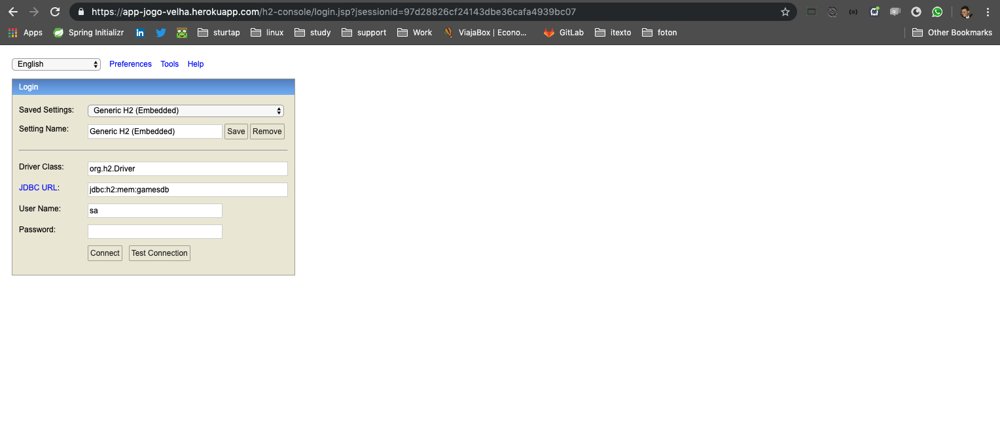
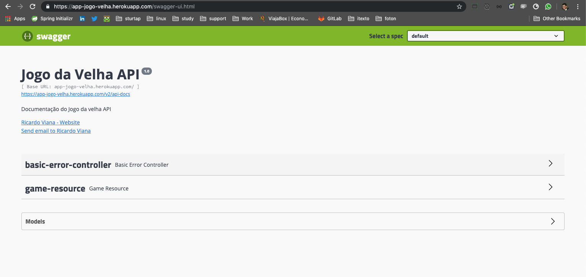

# Jogo da Velha

## Local

Maven
```
mvn clean install && java -jar target/game-0.0.1-SNAPSHOT.jar
```

Console H2:
http://localhost:8080/h2-console

Swagger:
http://localhost:8080/swagger-ui.html

Postman:
file /data/jogo-da-velha.postman_collection.json


## Heroku - Console H2
See [Heroku - Console H2](https://app-jogo-velha.herokuapp.com/h2-console).


## Heroku - Swagger

See [Heroku - Console H2](https://app-jogo-velha.herokuapp.com/swagger-ui.html).

